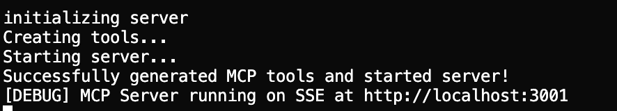

# OpenAPI x MCP

Generate a type-safe MCP (Model Context Protocol) server from an OpenAPI specification.

## CLI Commands

The package provides several CLI commands for managing your MCP server:

### Generate Server Code

Generate the MCP server code from your OpenAPI specification:

```bash
npx -y -p @usemodel-dev/cli@latest cli generate <ABSOLUTE_PATH_TO_SPEC_YAML_OR_JSON>

```

> This will create the mcp server files in the `cwd()` directory.

### Configure MCP Client Settings

The config command provides two operations for managing MCP server configurations:

#### Add or Update Configuration

Add or update MCP server settings for different clients:

```bash
npx -y -p @usemodel-dev/cli@latest cli config add <client> '<config_json>'
```

Where:
- `<client>` can be one of: `cursor`, `windsurf`, or `claude`
- `<config_json>` is a JSON string containing your configuration

Example:
```bash
# Add or update a server configuration for Cursor
npx -y -p @usemodel-dev/cli@latest cli config add cursor '{"@yourorg/mcp": {"url": "http://localhost:3000", "env": { "apiKey": "XXX" } } }'
```

#### Remove Configuration

Remove a specific server configuration from a client:

```bash
npx -y -p @usemodel-dev/cli@latest cli config remove <client> <servername>
```

Example:
```bash
# Remove a server configuration from Cursor
npx -y -p @usemodel-dev/cli@latest cli config remove cursor @yourorg/mcp
```

The configurations are stored in the following locations based on the client:
- Cursor: `~/.cursor/mcp.json`
- Windsurf: `~/.codeium/windsurf/mcp_config.json`
- Claude: `~/Library/Application Support/Claude/claude_desktop_config.json`

All configurations are stored under the `mcpServers` key in the config file. When adding new configurations, they will be merged with existing ones, and when updating existing configurations, they will be overwritten.

Run the server

```bash
npx -y  -p @usemodel-dev/cli@latest server
```

### Run the server locally

Build the server

```bash
pnpm build
```

> You need to run generate command before thi.s

```bash
pnpm start
```

This will start the server at `http:localhost:3001`



## Environment Variables

The server uses dotenv for configuration. Create a `.env` file in your project root with the necessary environment variables.

## Dependencies

This package uses several key dependencies:

- @modelcontextprotocol/sdk: For MCP implementation
- express: For the server framework
- openapi-typescript: For TypeScript type generation
- zod: For runtime type validation

## Contributing

This project is hosted on GitHub at https://github.com/@usemodel-dev/cli.git. Feel free to open issues or submit pull requests.

## License

MIT

## Package Information

Current version: 0.0.1
